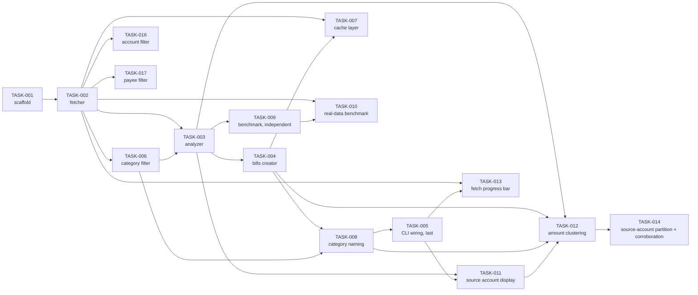

# Task Index and Implementation Order

**Numeric task order is NOT execution order.** The number in a task ID reflects
when the task was written, not when it should be implemented. Always follow the
sequence below; it is derived from the `Depends on` sections in each task file
and is the single authoritative ordering.

## Execution order

| Seq | Task | Depends on | Status | Condition |
| --- | ---- | ---------- | ------ | --------- |
| 1 | [TASK-001](TASK-001-project-scaffold.md) Project scaffold and configuration layer | — | done | — |
| 2 | [TASK-002](TASK-002-fetch-transactions.md) Fetch withdrawal transactions (UC1) | TASK-001 | done | Requires `get_withdrawal_transactions()` in `firefly-python-api` (that repo's TASK-005) |
| 3 | [TASK-006](TASK-006-category-filtering.md) Filter transactions by category (UC6) | TASK-002 | done | Open Item #7 resolved (spec v0.2.6, majority/mode-based tolerance) |
| 4 | [TASK-003](TASK-003-identify-recurring-payments.md) Identify recurring payments (UC2) | TASK-002, TASK-006 | done | — |
| 5 | [TASK-004](TASK-004-create-bills.md) Create bills in Firefly III (UC4) | TASK-003 | done | Required `create_bill()` and its `status_code`/`response_body` exception attributes in `firefly-python-api` (that repo's TASK-006 and TASK-007) |
| 6 | [TASK-008](TASK-008-category-aware-bill-naming.md) Include category name in bill name (UC6) | TASK-004, TASK-006 | done | — |
| 7 | [TASK-005](TASK-005-cli-and-dry-run.md) CLI orchestration, review flow, and dry-run (UC3 + UC5) | TASK-002, TASK-003, TASK-004, TASK-006, TASK-008 | done | Assembles the full pipeline. TASK-007 was skipped at the time, so `--clear-cache` shipped as a no-op with a "caching not implemented" message |
| 8 | [TASK-011](TASK-011-source-account-display.md) Display and export source account information (UC2/UC3/UC5) | TASK-003, TASK-005 | done | Extends the pipeline with source account resolution and display per FR-30a/b/d; test coverage for FR-31 (CLI file path printing) |
| 9 | [TASK-012](TASK-012-amount-clustering-and-billing-events.md) Amount clustering and billing event collapse (UC2) | TASK-003, TASK-004, TASK-008, TASK-011 | done | Splits payee groups into amount clusters based on same-date co-occurrence of differing amounts (revised FR-32a, spec 0.2.15, after real-data review showed pure amount-gap clustering fragmenting variable-price bills like electricity), collapses same-date transactions into billing events, computes statistics over events (not raw transactions), and disambiguates multi-cluster bill names per FR-32c |
| — | [TASK-009](TASK-009-performance-benchmark.md) Automated performance benchmark (NFR-05) | TASK-003 | done | Independent of the pipeline — run any time after TASK-003; closed Open Item #6 |
| — | [TASK-010](TASK-010-real-data-benchmark.md) Calibrate performance benchmark against real transaction data (UC8) | TASK-002, TASK-009 | done | Independent of the pipeline — manual, opt-in, requires real Firefly III credentials; closed Open Item #9 |
| — | [TASK-013](TASK-013-cli-fetch-progress-bar.md) CLI progress bar for transaction fetch (UC1) | TASK-002, TASK-005 | done | `firefly-python-api`'s REQ-008/TASK-011 (`on_page` callback on `get_withdrawal_transactions()`) implemented and merged upstream (PR #11); `lib/firefly-python-api` re-synced here via `git subtree pull`; `fetch_transactions()` now drives a `tqdm` progress bar per page |
| — | [TASK-007](TASK-007-cache-layer.md) Local file cache layer (UC7) | TASK-002, TASK-004 | done | Un-deferred 2026-07-11 (Open Item #8 further resolved, spec v0.2.16): TTL-aware disk cache for transactions (window-keyed) and bills, motivated by faster local development/test cycles against real Firefly III data (verified: ~2min live fetch vs. ~0.4s cache hit); `--clear-cache` now actually deletes cache files |
| 10 | [TASK-014](TASK-014-source-account-partition-and-corroborated-clustering.md) Source-account partitioning and corroborated amount clustering (UC2) | TASK-012 | done | Owner review of a real report found payee "ICA" fragmented into 15 rows: transactions spanning two source accounts (a fixed transfer vs. the spending it funds) were amount-clustered together, and a single incidental same-day double purchase was enough to trigger a split. FR-32d (new) partitions by source account before FR-32a; FR-32a (revised, spec v0.2.17) requires a co-occurrence split to be corroborated by a repeating signature across 2+ distinct dates. Verified against real data: ICA dropped from 15 rows to 3 |
| 11 | [TASK-016](TASK-016-account-filtering.md) Filter transactions by source account (UC9) | TASK-002 | done | Spec v0.2.18: `INCLUDE_ACCOUNTS`/`EXCLUDE_ACCOUNTS`, modeled on TASK-006's category filter but exclude-and-include only, no confidence weighting. FR-35c (web UI multiselect) deferred, contingent on Open Item #5. Renumbered from TASK-014 to resolve a task-ID collision with the source-account-partitioning task above, which was merged upstream (PR #15) under the same number on a diverging branch |
| 12 | [TASK-017](TASK-017-payee-filtering.md) Filter transactions by payee / destination account (UC10) | TASK-002 | not started | Spec v0.2.19: `INCLUDE_PAYEES`/`EXCLUDE_PAYEES`, modeled on TASK-016's account filter but matched against `destination_name` instead of `source_name`. Also updates `.env.example` with the new variables. FR-36c (web UI multiselect) deferred, contingent on Open Item #5. Renumbered from TASK-015 for the same reason as TASK-016 |

## Dependency graph

## Rules

- One task per branch (`task/<NNN>-short-description`), per the branch policy in `CLAUDE.md`.
- A task may not be started before every task it depends on has status `done`.
  (Historical exception, now resolved: TASK-005 shipped before TASK-007,
  which was deferred at the time — see TASK-007's own Status note.)
- When a new task file is added, add it to the table and graph above in the same
  commit, with an explicit position in the sequence.
- When a task's status changes, update the Status column here in the same commit
  that updates the task file.
- Open Items referenced above live in `docs/REQUIREMENTS_new.md`.
