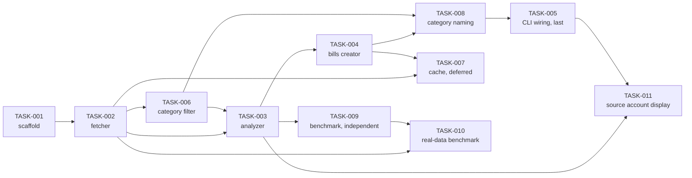

# Task Index and Implementation Order

**Numeric task order is NOT execution order.** The number in a task ID reflects
when the task was written, not when it should be implemented. Always follow the
sequence below; it is derived from the `Depends on` sections in each task file
and is the single authoritative ordering.

## Execution order

| Seq | Task | Depends on | Status | Condition |
| --- | ---- | ---------- | ------ | --------- |
| 1 | [TASK-001](TASK-001-project-scaffold.md) Project scaffold and configuration layer | — | done | — |
| 2 | [TASK-002](TASK-002-fetch-transactions.md) Fetch withdrawal transactions (UC1) | TASK-001 | done | Requires `get_withdrawal_transactions()` in `firefly-python-api` (that repo's TASK-005) |
| 3 | [TASK-006](TASK-006-category-filtering.md) Filter transactions by category (UC6) | TASK-002 | done | Open Item #7 resolved (spec v0.2.6, majority/mode-based tolerance) |
| 4 | [TASK-003](TASK-003-identify-recurring-payments.md) Identify recurring payments (UC2) | TASK-002, TASK-006 | done | — |
| 5 | [TASK-004](TASK-004-create-bills.md) Create bills in Firefly III (UC4) | TASK-003 | done | Required `create_bill()` and its `status_code`/`response_body` exception attributes in `firefly-python-api` (that repo's TASK-006 and TASK-007) |
| 6 | [TASK-008](TASK-008-category-aware-bill-naming.md) Include category name in bill name (UC6) | TASK-004, TASK-006 | done | — |
| 7 | [TASK-007](TASK-007-cache-layer.md) Local file cache layer (UC7) | TASK-002, TASK-004 | deferred | Open Item #8 resolved 2026-07-11: deprioritized/skipped for the terminal-only MVP, contingent on Open Item #5 (web UI) — revisit if a web UI task is created |
| 8 | [TASK-005](TASK-005-cli-and-dry-run.md) CLI orchestration, review flow, and dry-run (UC3 + UC5) | TASK-002, TASK-003, TASK-004, TASK-006, TASK-008 | done | Assembles the full pipeline. TASK-007 skipped, so `--clear-cache` is a no-op with a "caching not implemented" message |
| 9 | [TASK-011](TASK-011-source-account-display.md) Display and export source account information (UC2/UC3/UC5) | TASK-003, TASK-005 | not started | Extends the pipeline with source account resolution and display per FR-30a/b/d; test coverage for FR-31 (CLI file path printing) |
| — | [TASK-009](TASK-009-performance-benchmark.md) Automated performance benchmark (NFR-05) | TASK-003 | done | Independent of the pipeline — run any time after TASK-003; closed Open Item #6 |
| — | [TASK-010](TASK-010-real-data-benchmark.md) Calibrate performance benchmark against real transaction data (UC8) | TASK-002, TASK-009 | done | Independent of the pipeline — manual, opt-in, requires real Firefly III credentials; closed Open Item #9 |

## Dependency graph

## Rules

- One task per branch (`task/<NNN>-short-description`), per the branch policy in `CLAUDE.md`.
- A task may not be started before every task it depends on has status `done`,
  except TASK-007/TASK-005 where the conditional rule above applies.
- When a new task file is added, add it to the table and graph above in the same
  commit, with an explicit position in the sequence.
- When a task's status changes, update the Status column here in the same commit
  that updates the task file.
- Open Items referenced above live in `docs/REQUIREMENTS_new.md`.
