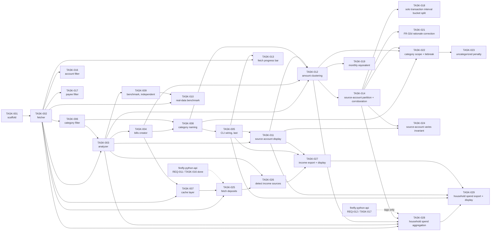

# Task Index and Implementation Order

**Numeric task order is NOT execution order.** The number in a task ID reflects
when the task was written, not when it should be implemented. Always follow the
sequence below; it is derived from the `Depends on` sections in each task file
and is the single authoritative ordering.

## Execution order

| Seq | Task | Depends on | Status | Condition |
| --- | ---- | ---------- | ------ | --------- |
| 1 | [TASK-001](TASK-001-project-scaffold.md) Project scaffold and configuration layer | — | done | — |
| 2 | [TASK-002](TASK-002-fetch-transactions.md) Fetch withdrawal transactions (UC1) | TASK-001 | done | Requires `get_withdrawal_transactions()` in `firefly-python-api` (that repo's TASK-005) |
| 3 | [TASK-006](TASK-006-category-filtering.md) Filter transactions by category (UC6) | TASK-002 | done | Open Item #7 resolved (spec v0.2.6, majority/mode-based tolerance) |
| 4 | [TASK-003](TASK-003-identify-recurring-payments.md) Identify recurring payments (UC2) | TASK-002, TASK-006 | done | — |
| 5 | [TASK-004](TASK-004-create-bills.md) Create bills in Firefly III (UC4) | TASK-003 | done | Required `create_bill()` and its `status_code`/`response_body` exception attributes in `firefly-python-api` (that repo's TASK-006 and TASK-007) |
| 6 | [TASK-008](TASK-008-category-aware-bill-naming.md) Include category name in bill name (UC6) | TASK-004, TASK-006 | done | — |
| 7 | [TASK-005](TASK-005-cli-and-dry-run.md) CLI orchestration, review flow, and dry-run (UC3 + UC5) | TASK-002, TASK-003, TASK-004, TASK-006, TASK-008 | done | Assembles the full pipeline. TASK-007 was skipped at the time, so `--clear-cache` shipped as a no-op with a "caching not implemented" message |
| 8 | [TASK-011](TASK-011-source-account-display.md) Display and export source account information (UC2/UC3/UC5) | TASK-003, TASK-005 | done | Extends the pipeline with source account resolution and display per FR-30a/b/d; test coverage for FR-31 (CLI file path printing) |
| 9 | [TASK-012](TASK-012-amount-clustering-and-billing-events.md) Amount clustering and billing event collapse (UC2) | TASK-003, TASK-004, TASK-008, TASK-011 | done | Splits payee groups into amount clusters based on same-date co-occurrence of differing amounts (revised FR-32a, spec 0.2.15, after real-data review showed pure amount-gap clustering fragmenting variable-price bills like electricity), collapses same-date transactions into billing events, computes statistics over events (not raw transactions), and disambiguates multi-cluster bill names per FR-32c |
| — | [TASK-009](TASK-009-performance-benchmark.md) Automated performance benchmark (NFR-05) | TASK-003 | done | Independent of the pipeline — run any time after TASK-003; closed Open Item #6 |
| — | [TASK-010](TASK-010-real-data-benchmark.md) Calibrate performance benchmark against real transaction data (UC8) | TASK-002, TASK-009 | done | Independent of the pipeline — manual, opt-in, requires real Firefly III credentials; closed Open Item #9 |
| — | [TASK-013](TASK-013-cli-fetch-progress-bar.md) CLI progress bar for transaction fetch (UC1) | TASK-002, TASK-005 | done | `firefly-python-api`'s REQ-008/TASK-011 (`on_page` callback on `get_withdrawal_transactions()`) implemented and merged upstream (PR #11); `lib/firefly-python-api` re-synced here via `git subtree pull`; `fetch_transactions()` now drives a `tqdm` progress bar per page |
| — | [TASK-007](TASK-007-cache-layer.md) Local file cache layer (UC7) | TASK-002, TASK-004 | done | Un-deferred 2026-07-11 (Open Item #8 further resolved, spec v0.2.16): TTL-aware disk cache for transactions (window-keyed) and bills, motivated by faster local development/test cycles against real Firefly III data (verified: ~2min live fetch vs. ~0.4s cache hit); `--clear-cache` now actually deletes cache files |
| 10 | [TASK-014](TASK-014-source-account-partition-and-corroborated-clustering.md) Source-account partitioning and corroborated amount clustering (UC2) | TASK-012 | done | Owner review of a real report found payee "ICA" fragmented into 15 rows: transactions spanning two source accounts (a fixed transfer vs. the spending it funds) were amount-clustered together, and a single incidental same-day double purchase was enough to trigger a split. FR-32d (new) partitions by source account before FR-32a; FR-32a (revised, spec v0.2.17) requires a co-occurrence split to be corroborated by a repeating signature across 2+ distinct dates. Verified against real data: ICA dropped from 15 rows to 3 |
| 11 | [TASK-016](TASK-016-account-filtering.md) Filter transactions by source account (UC9) | TASK-002 | done | Spec v0.2.18: `INCLUDE_ACCOUNTS`/`EXCLUDE_ACCOUNTS`, modeled on TASK-006's category filter but exclude-and-include only, no confidence weighting. FR-35c (web UI multiselect) deferred, contingent on Open Item #5. Renumbered from TASK-014 to resolve a task-ID collision with the source-account-partitioning task above, which was merged upstream (PR #15) under the same number on a diverging branch |
| 12 | [TASK-017](TASK-017-payee-filtering.md) Filter transactions by payee / destination account (UC10) | TASK-002 | done | Spec v0.2.19: `INCLUDE_PAYEES`/`EXCLUDE_PAYEES`, modeled on TASK-016's account filter but matched against `destination_name` instead of `source_name`. Also updates `.env.example` with the new variables. FR-36c (web UI multiselect) deferred, contingent on Open Item #5. Renumbered from TASK-015 for the same reason as TASK-016 |
| 13 | [TASK-018](TASK-018-solo-transaction-interval-bucket-split.md) Separate solo transactions into their own cluster when frequency buckets disagree (FR-32e) | TASK-012, TASK-014 | done | Owner review of a real report found payee "STOCKHOLM VATTEN AB" merging a yearly garden-waste charge into a quarterly garbage-collection cluster, because FR-32a's nearest-mean assignment (TASK-012/TASK-014) only considers amount proximity for solo (non-co-occurring) transactions. FR-32e (spec v0.2.21) adds a secondary interval/frequency-bucket check, reusing the existing `_classify_frequency()` helper: 2+ solo transactions whose own median interval disagrees with their nearest cluster's now split off into their own cluster instead of being folded in |
| 14 | [TASK-019](TASK-019-normalized-monthly-equivalent-per-pattern.md) Normalized monthly equivalent per pattern (FR-37) | TASK-012 | done | Spec v0.2.22: adds a `monthly_equivalent` field to `RecurringPattern`, derived from `frequency` and `amount_mean` via fixed divisors; `None` for `irregular`. Flows into the CSV/JSON export automatically via `exporter._FIELDNAMES` |
| — | [TASK-020](TASK-020-Household-contribution-split-report.md) Household contribution split report (UC11) | TASK-019, TASK-016 | moved | Spec v0.2.24: Open Item #10 resolved as option (b) — UC11 does not belong in this repository. FR-08's export already carries every field UC11 needs, so it moves to a separate consumer of that export. UC11, FR-38a-f, NFR-12, and `HOUSEHOLD_*` config removed from the spec; not implemented here |
| 15 | [TASK-021](TASK-021-fr32d-rationale-correction.md) Correct FR-32d's transfer-based rationale (documentation only) | TASK-014 | todo | Spec v0.2.23: FR-32d, UC2 step 2.a, and the `_partition_by_source_account()` docstring motivated source-account partitioning with a transfer-versus-spending example that cannot occur, since `fetch_transactions()` only ever supplies withdrawals. Normative content of FR-32d is unchanged; this task brings the code comment into line and adds the assertion that keeps the claim true |
| 16 | [TASK-022](TASK-022-category-scope-and-tiebreak.md) Align category resolution scope with amount clusters and define tie-breaking (FR-13b) | TASK-008, TASK-012, TASK-014 | todo | Spec v0.2.23: FR-13b required the category majority share to be computed over all of a payee's transactions, but `_build_pattern()` computes it over the amount cluster, which is the unit FR-32c names a bill from. The requirement was stale, not the implementation; this task revises FR-13b to cluster scope and defines tie-breaking |
| 17 | [TASK-023](TASK-023-uncategorized-penalty-misapplied.md) Stop penalizing fully categorized patterns that resolve no category name (FR-13c, FR-27) | TASK-022 | todo | `_confidence()` applies `UNCATEGORIZED_CONFIDENCE_PENALTY` whenever `category_name is None`, conflating "no transaction carries a category" with "categories present but none reaches `CATEGORY_MAJORITY_THRESHOLD`". Only the first is a data-quality signal; the second is a naming outcome and must not be penalized |
| 18 | [TASK-024](TASK-024-source-account-varies-invariant.md) Turn the source-account "varies" flag into an FR-32d invariant check (FR-30a, FR-30e) | TASK-011, TASK-014 | todo | FR-32d partitions every payee group by `source_name` before clustering, so FR-30a's mode computation is redundant and `source_account_varies` can no longer be `True`, leaving FR-30b's CLI "(varies)" branch and FR-30d's exported field describing an unreachable state. Retained as an invariant check rather than deleted |
| 19 | [TASK-025](TASK-025-fetch-deposits-for-income-accounts.md) Fetch deposits for configured income accounts (UC12) | TASK-002, TASK-007 | todo | Spec v0.2.25: adds the `INCOME_*` configuration and `fetcher.fetch_deposits()`, the deposit-side ingestion path behind FR-40a-d and NFR-13/NFR-14. Unblocked 2026-08-02: `firefly-python-api` REQ-011 (`get_deposit_transactions()`) is done as that repository's TASK-016; re-sync `lib/firefly-python-api` before starting |
| 20 | [TASK-026](TASK-026-detect-income-sources.md) Detect income sources and resolve observed net income (UC12) | TASK-025, TASK-003 | blocked | Spec v0.2.25: new `income.py` groups deposits by income account and payer, reuses `_classify_frequency()`, and resolves one income source per account. FR-43 fixes the reported figure to the most recent occurrence rather than the mean, so a pay rise is not hidden for the depth of the lookback window; FR-42c makes two qualifying payers on one account an ambiguity to report rather than a sum |
| 21 | [TASK-027](TASK-027-income-export-and-display.md) Export and display income sources (UC12) | TASK-026, TASK-005, TASK-011 | blocked | Spec v0.2.25: a second export file alongside the pattern export, carrying income sources and, per FR-45c, the accounts where detection failed, so a missing income is a visible row rather than an absent one. CLI displays both before the review flow (FR-46) |
| 22 | [TASK-028](TASK-028-household-spend-aggregation.md) Aggregate household spend per account and category (UC13) | TASK-002, TASK-003, TASK-012, TASK-014 | todo | Spec v0.2.26: measures the shared spending recurrence detection cannot see. Groceries bought eight times a month have a median interval of days, so FR-03 classifies them `irregular` and every downstream total drops them, leaving the member who pays them treated as having contributed nothing. New `household_spend.py` sums per account, category, and calendar month and reports the median. FR-48b's dedup against identified patterns is the step most likely to be got wrong. The category path has no upstream dependency; FR-48d/FR-48e's tag overrides need `firefly-python-api` REQ-012 (TASK-017), and FR-48g keeps the module working without it |
| 23 | [TASK-029](TASK-029-household-spend-export-and-display.md) Export and display household spend (UC13) | TASK-028, TASK-005, TASK-011, TASK-027 | blocked | Spec v0.2.26: the third export file, carrying the monthly figures, the one-off purchases set aside under FR-48c, unmatched categories, and the tag correction counts. A `record_type` column separates the two row shapes so a consumer's parse does not depend on which fields are empty |

## Dependency graph

```mermaid
graph LR
    T001[TASK-001<br/>scaffold] --> T002[TASK-002<br/>fetcher]
    T002 --> T006[TASK-006<br/>category filter]
    T002 --> T003[TASK-003<br/>analyzer]
    T006 --> T003
    T003 --> T004[TASK-004<br/>bills creator]
    T004 --> T008[TASK-008<br/>category naming]
    T006 --> T008
    T002 --> T007[TASK-007<br/>cache layer]
    T004 --> T007
    T008 --> T005[TASK-005<br/>CLI wiring, last]
    T003 --> T009[TASK-009<br/>benchmark, independent]
    T002 --> T010[TASK-010<br/>real-data benchmark]
    T009 --> T010
    T003 --> T011[TASK-011<br/>source account display]
    T005 --> T011
    T003 --> T012[TASK-012<br/>amount clustering]
    T004 --> T012
    T008 --> T012
    T011 --> T012
    T002 --> T013[TASK-013<br/>fetch progress bar]
    T005 --> T013
    T012 --> T014[TASK-014<br/>source-account partition + corroboration]
    T002 --> T016[TASK-016<br/>account filter]
    T002 --> T017[TASK-017<br/>payee filter]
    T014 --> T018[TASK-018<br/>solo transaction interval bucket split]
    T012 --> T019[TASK-019<br/>monthly equivalent]
    T014 --> T021[TASK-021<br/>FR-32d rationale correction]
    T008 --> T022[TASK-022<br/>category scope + tiebreak]
    T012 --> T022
    T014 --> T022
    T022 --> T023[TASK-023<br/>uncategorized penalty]
    T011 --> T024[TASK-024<br/>source-account varies invariant]
    T014 --> T024
    T002 --> T025[TASK-025<br/>fetch deposits]
    T007 --> T025
    API011[firefly-python-api<br/>REQ-011 / TASK-016 done] -.-> T025
    T025 --> T026[TASK-026<br/>detect income sources]
    T003 --> T026
    T026 --> T027[TASK-027<br/>income export + display]
    T005 --> T027
    T011 --> T027
    T002 --> T028[TASK-028<br/>household spend aggregation]
    T003 --> T028
    T012 --> T028
    T014 --> T028
    API012[firefly-python-api<br/>REQ-012 / TASK-017] -.tags only.-> T028
    T028 --> T029[TASK-029<br/>household spend export + display]
    T005 --> T029
    T011 --> T029
    T027 --> T029
```

## Rules

- One task per branch (`task/<NNN>-short-description`), per the branch policy in `CLAUDE.md`.
- A task may not be started before every task it depends on has status `done`.
  (Historical exception, now resolved: TASK-005 shipped before TASK-007,
  which was deferred at the time — see TASK-007's own Status note.)
- When a new task file is added, add it to the table and graph above in the same
  commit, with an explicit position in the sequence.
- When a task's status changes, update the Status column here in the same commit
  that updates the task file.
- Open Items referenced above live in `docs/REQUIREMENTS_new.md`.
